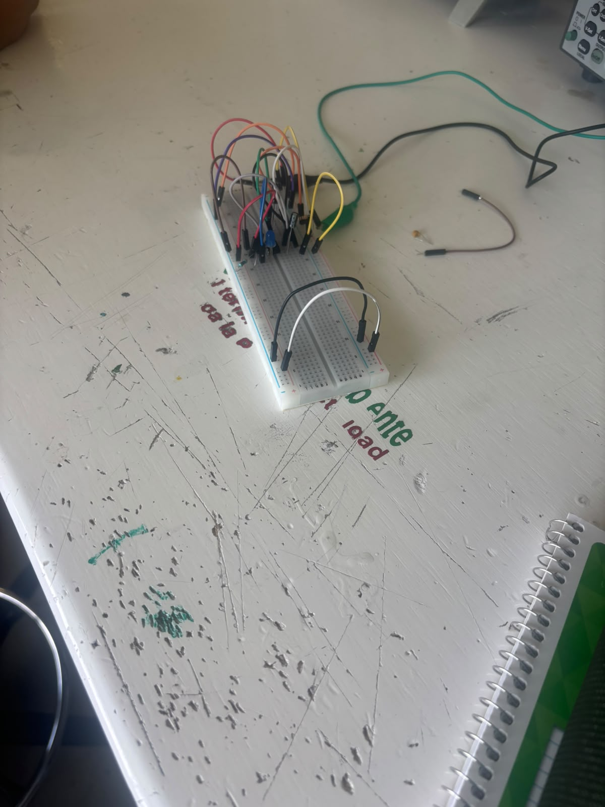

# Circuito con temporizador
Martin Urbina Revuelta

Introduccion a la mecatronica

fecha: 28/08/26

Se usan los capacitores y resistencias para que el LED parpadee, los leds funcionan de esta manera pero parpadean en microsegundos por lo que no se percibe pero este circuito hace que el parpadeo tarde mas tiempo y sea visible

# Objetivos
Usar las propiedades del LED para poder hacerlo parpadear

# Alcance
Se puede aplicar en luces que tienen que estar y apagadas por cierto periodo de tiempo

# Requisitos
se uso una protoboard, jumpers, luz led, resistencias, capacitores y caimanes

# Realizacion

Se conectan jumpers al protoboard para puentear y conectarse a los caimanes para tener corriente y los otros jumpers se conectan al led, las resistencias y el capacitor para que se pueda dar luz y que haya pausas lo suficientemente largas para que se pueda ver que parpadea a simple vista

<video controls width="600">
<source src="recursos/imgs/meca2809vid.mp4">