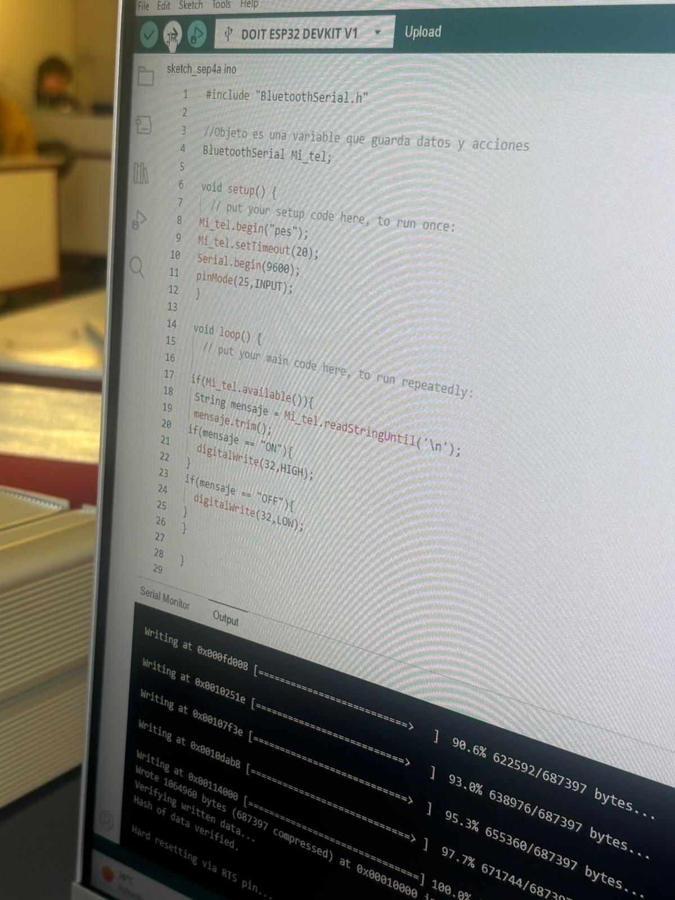
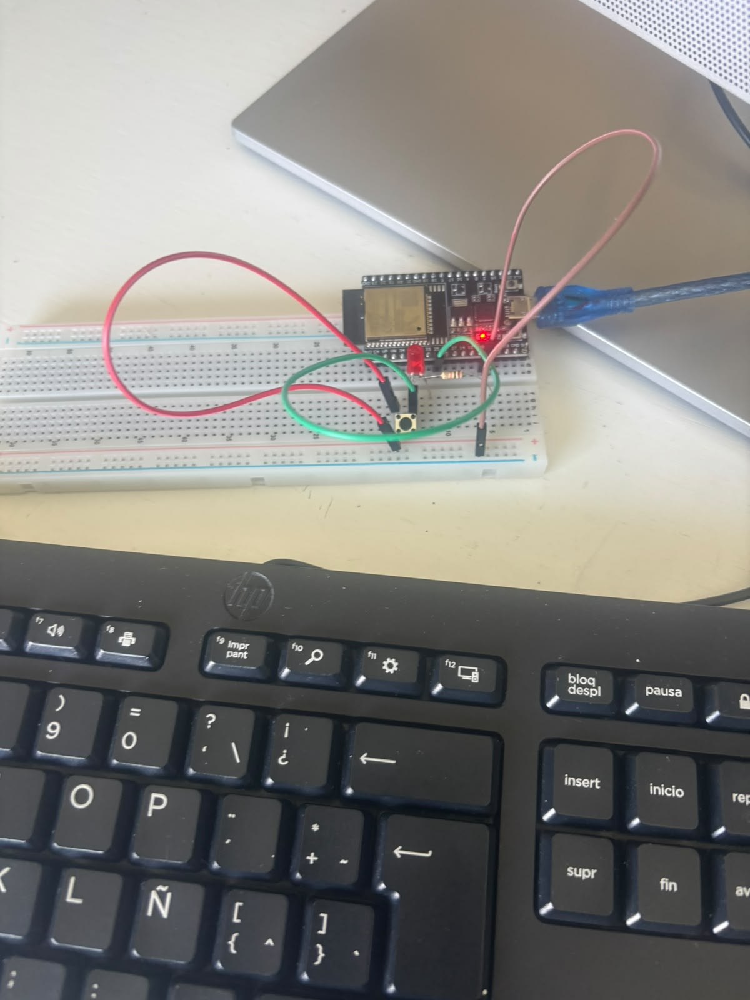

# Circuito de arduino
Martin Urbina Revuelta

Introduccion a la mecatronica

fecha: 04/09/26

Se usa el arduino para que con el boton se escriba un flujo continuo de texto

# Objetivos
Usar las el boton para activar o no el flujo texto

# Alcance
Se puede aplicar en mecanismos que necesiten activacion remota

# Requisitos
se uso una protoboard, jumpers, luz led, resistencias, boton y arduino

# Realizacion
se conectaba el boton y los jumpers y el arduino con el cable usb y luego con el codigo se escribe una cadena constante de codigo mientras que el boton este encendido, al dejar de presionarlo esta terminara

Codigo:

#include "bluetoohSerial.h"
BluetoothSerial Mi_tel;

void setup ()
{
    
    Mi_tel.begom("pes");
    Mi_tel.setTimeout(20);
    Serial.begin(9600);
    pinmode(25, INPUT);
    
}
void loop ()
{

    if(Mi_tel.available()){
    string mensaje = Mi_tel.readStringUntil('\n');
    mensaje.trim();
    if(mensaje == "ON"){
        digitalWrite(32,HIGH);
    }
    if(mensaje == "OFF"){
        digitalWrite(32,HIGH);
    }
    }

}
