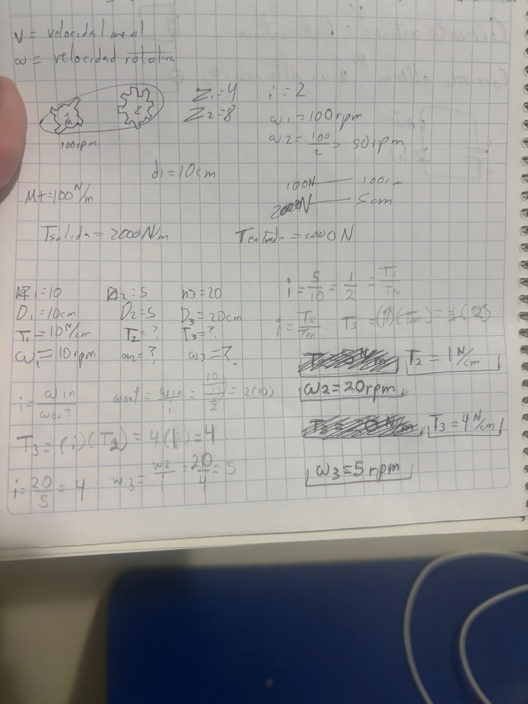
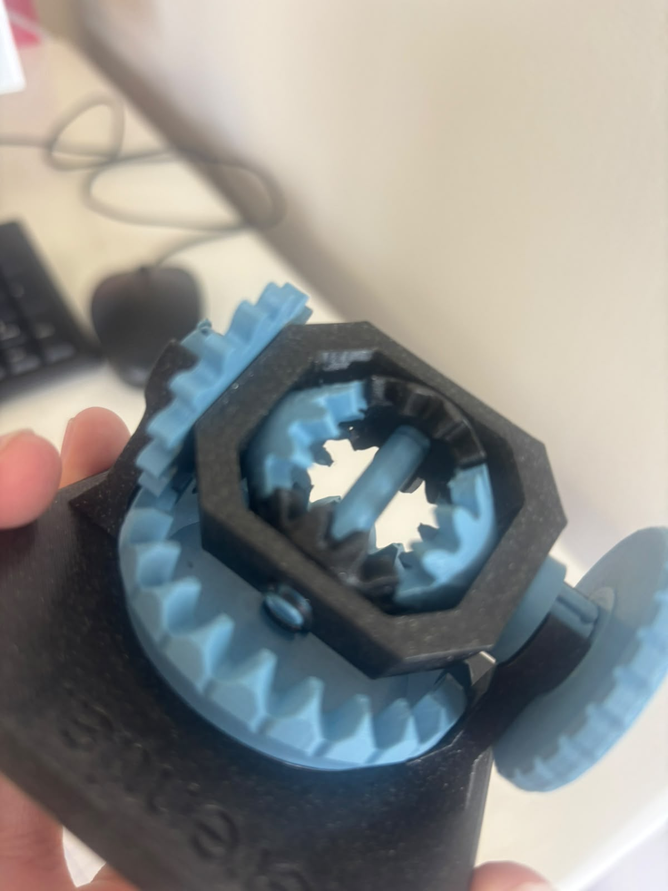
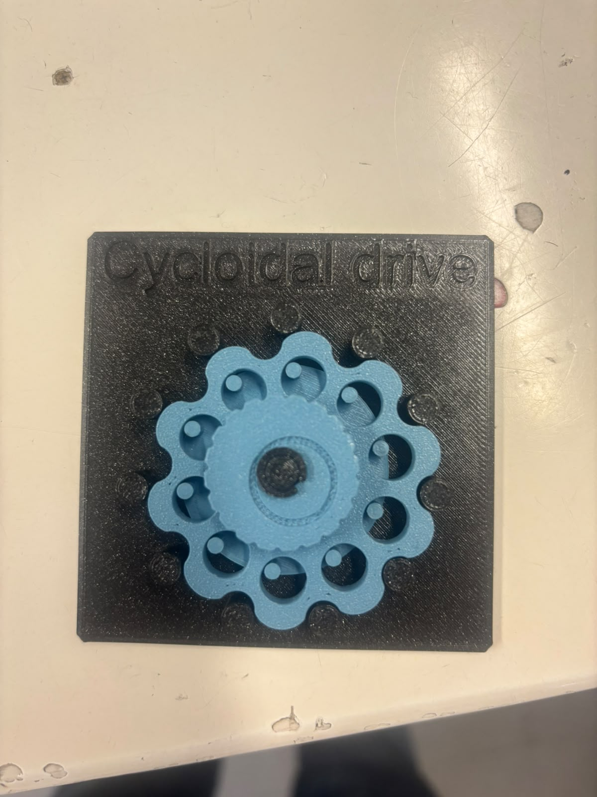
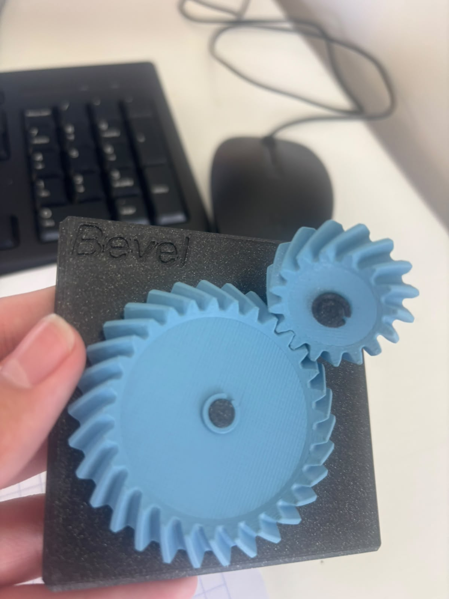
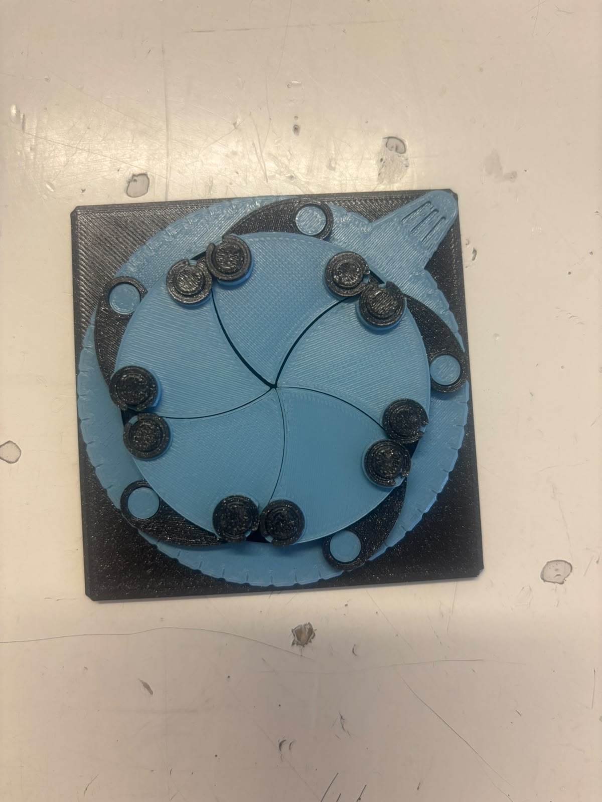

# Engranajes
Martin Urbina Revuelta

Introduccion a la mecatronica

fecha: 18/09/26

El uso de la fórmula de relación de transmisión para calcular el cambio de velocidad y fuerza del torque entre engranajes, tambien una explicación de diferentes tipos de configuraciones de engranes

# Objetivos
Poder conocer tipos de engranes y sus usos asi como calcular sus propiedades

# Alcance
Usable en cualquier maquina que requiera engranjes para saber que tan potente y eficiente sera y cual configuracion de engranes seria la mejor para cierta situacion

# Requisitos
engranes

# Realizacion
Usando la formula de:
i=(Z2/Z1)=(wentrada/wsalida)=(Tsalida/Tentrada)
donde

i=relacion de transmisión

Z= numero de dientes del engrane

w= velocidad de rotacion

T= torque

Se puede calcular y despejar los datos presentados, tomando en cuenta que si el engrane de salida es de mayor tamaño es más grande que el de entrada su velocidad sera menor por que tardara mas tiempo en dar una vuelta y su torque sera mayor al estar haciendo más fuerza, en el caso contrario la velocidad sera mayor y el torque menor al engrane de salida, esto se puede comprobar con el siguiente problema realizado en clase:

en el caso del T2, T1 se divide entre 5 porque tiene un valor 10 N/cm, lo que significa que tendrian una fuerza de 10 en el primer centimetro, pero este engrane tiene un diametro de 5 cm por lo que se divide por este valor para sacar el verdadero valor de su torque, y asi para sacar T3 al T2 no se le hace lo mismo porque su torque ya estaria en la orilla y no empieza desde el centro así que no disminuiría más.

# Tipos de engranes

## 1.Diferencial
un engranaje diferencial  es un sistema que permite que las ruedas de un vehículo puedan girar a velocidades distintas cuando toma una curva

## 2.Cicloidal
Está formado por 2 o más ruedas dentadas que encajan entre sí para transmitir movimiento circular y potencia mecánica, sirve para cambiar de velocidad y  cambiar de dirección

## 3.Cardán
Conecta dos engranajes que no estan alineados y sirme para cambiar la dirección en la que va el engrane moviendolo 90°, usado en autos, motos y maquinaria 

## 4.Obturador
Forma parte de un mecanismo de accionamiento de un motor  del obturador en cámaras o equipos ópticos e impresoras

