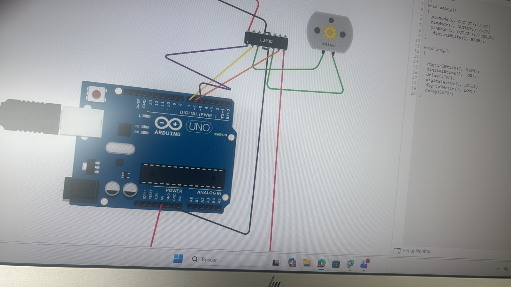

# Motor
Martin Urbina Revuelta

Introduccion a la mecatronica

fecha: 11/09/26

Se usa arduino para hacer que se muevan 2 motores simultaneamente en diferentes configuraciones

# Objetivos
Usar los motores en arduino

# Alcance
Aplicable para mecanismos que requieran rotaciones cambiantes

# Requisitos
se uso arduino

# Realizacion
Se conecta el arduino a la compuerta y de la compuerta al motor, de ahi el se realiza el codigo para que pueda girar cada cierto tiempo.

Despues se conecta un segundo motor y un servo motor, se hacen mas codigo para que ambos motores simples cambien de direccion cada cierto tiempo mientras el servo motor gira al mismo tiempo

Codigo:
void setup ()
{
    
    pinmode(6, OUTPUT);
    pinmode(7, OUTPUT);
    pinmode(5, OUTPUT);
    digitalWrite(5,HIGH);
}
void loop ()
{

    digitalWrite(7,HIGH);
    digitalWrite(6,LOW);
    delay (1000);
    digitalWrite(6,HIGH);
    digitalWrite(7,LOW);
    delay (1000);

}

Codigo:
#include <Servo.h>
Servo juan;
void adelante(){

    digitalWrite(6,HIGH);
    digitalWrite(7,LOW);
    digitalWrite(12,HIGH);
    digitalWrite(13,LOW);
}
void atras(){

    digitalWrite(7,HIGH);
    digitalWrite(6,LOW);
    digitalWrite(13,HIGH);
    digitalWrite(12,LOW);
}
void der(){

    digitalWrite(6,HIGH);
    digitalWrite(7,LOW);
    digitalWrite(13,HIGH);
    digitalWrite(12,LOW);
}
void izq(){

    digitalWrite(7,HIGH);
    digitalWrite(6,LOW);
    digitalWrite(12,HIGH);
    digitalWrite(13,LOW);
}
void setup ()
{
    
    pinmode(6, OUTPUT);
    pinmode(7, OUTPUT);
    pinmode(5, OUTPUT);

    pinmode(12, OUTPUT);
    pinmode(13, OUTPUT);
    pinmode(11, OUTPUT);

    digitalWrite(5,HIGH);
    digitalWrite(11,HIGH);
}

void loop ()
{

    juan.write(0);
    adelante();
    delay (1000);
    atras();
    delay (1000);
    der();
    delay (1000);
    izq();
    delay (1000);

}

<video controls width="600">
<source src="recursos/imgs/meca1109vid.mp4">

